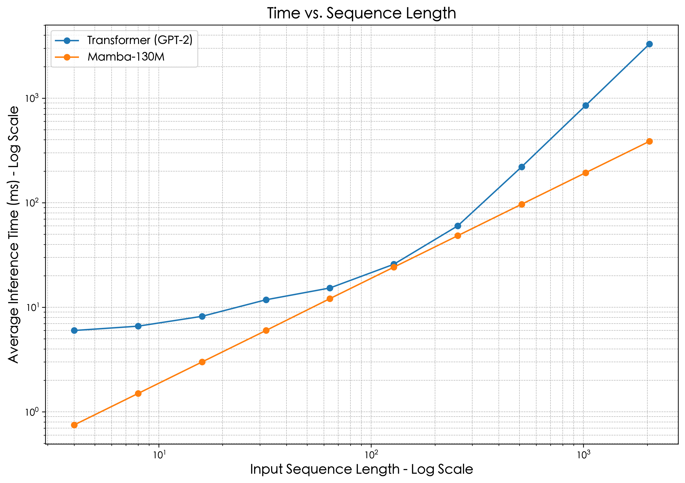

# Image Captioning: From Pixels to Prose

<div align="center">
  
  
  **An Architectural Analysis of Image Captioning Systems**
  
  [](https://www.python.org/downloads/)
</div>

## 🎯 Overview

This project presents a comprehensive analysis of image captioning architectures through a modular framework that systematically evaluates different combinations of vision encoders, language decoders, and vision-language connectors. Our goal is to understand how different architectural choices impact performance in generating natural language descriptions of images.

## 🏗️ Architecture Components

### Vision Encoders
We evaluate four different vision encoders:

- **ResNet-50**: CNN-based encoder with strong inductive bias
- **Vision Transformer (ViT)**: Self-attention based encoder with global receptive field
- **Vision Mamba (Vim)**: Linear complexity encoder for efficient high-resolution processing
- **MambaVision**: Hybrid Mamba-Transformer architecture achieving SOTA performance

<div align="center">
  
</div>

### Language Decoders
- **GPT-2**: Autoregressive transformer with rich language knowledge
- **Qwen2**: Advanced transformer model with enhanced capabilities
- **LLaMA 3**: Large language model with superior generation quality
- **Mamba**: State space model with linear complexity for efficient long sequence processing

### Vision-Language Connectors
- **MLP Projector**: Simple multi-layer perceptron for feature projection
- **Q-Former**: Transformer-based connector using learnable query vectors

<div align="center">
  
</div>

## 📊 Experimental Results

### Dataset & Metrics
- **Dataset**: MS COCO 2017 (120K+ images with 5 human-annotated captions each)
- **Evaluation Metrics**: BLEU (n-gram precision) and CIDEr (consensus-based similarity)

### Key Findings

#### Vision Encoder Ablation (GPT-2 + MLP)
| Model | Architecture | BLEU-4 | CIDEr |
|-------|-------------|--------|-------|
| ResNet-50 | CNN | 20.3 | 90.4 |
| ViT-Base | Transformer | 24.3 | 98.8 |
| Vision Mamba | Mamba | 26.2 | 97.1 |
| **MambaVision** | **Hybrid** | **28.9** | **104.2** |

#### Language Decoder Ablation (ViT + MLP)
| Model | Architecture | BLEU-4 | CIDEr |
|-------|-------------|--------|-------|
| GPT-2 | Transformer | 24.3 | 98.8 |
| Qwen2-3B | Transformer | 26.9 | 105.4 |
| LLaMA-3B | Transformer | 27.1 | 108.6 |
| **Mamba-130m** | **Mamba** | **29.2** | **110.7** |

#### Connector Ablation (ViT + GPT-2)
| Model | Architecture | BLEU-4 | CIDEr | Training Time |
|-------|-------------|--------|-------|--------------|
| MLP | 2-layer | 24.3 | 98.8 | ~8h |
| **Q-Former** | **Transformer** | **28.4** | **100.4** | **~4h** |

## 🚀 Performance Analysis

### Computational Complexity Comparison

<div align="center">
  
</div>

**Key Insights:**
- **Transformer**: Quadratic complexity O(N²) - inference time grows rapidly with sequence length
- **Mamba**: Linear complexity O(N) - stable, predictable performance scaling

### Example Results

<div align="center">
  
</div>

**Generated Caption**: "Computer desk with a monitor and keyboard on it."

## 🔧 Installation & Usage

```bash
# Clone the repository
git clone https://github.com/Nahuyiur/CS308-Computer-Vision-Project.git
cd CS308-Computer-Vision-Project

# Install dependencies
pip install -r requirements.txt

# Run experiments
python main.py --encoder vit --decoder gpt2 --connector mlp
```

## 📈 Key Contributions

1. **Modular Framework**: Systematic evaluation of different architectural components
2. **Comprehensive Ablation**: Detailed analysis of vision encoders, language decoders, and connectors
3. **Performance Insights**: Understanding of computational complexity trade-offs
4. **SOTA Results**: MambaVision hybrid architecture achieving best performance

## 🎓 Authors

- **王子恒** (Wang Ziheng)
- **娄毅彬** (Lou Yibin) 
- **方酉城** (Fang Youcheng)
- **芮煜涵** (Rui Yuhan)

*Southern University of Science and Technology (SUSTech) - Computer Vision*
